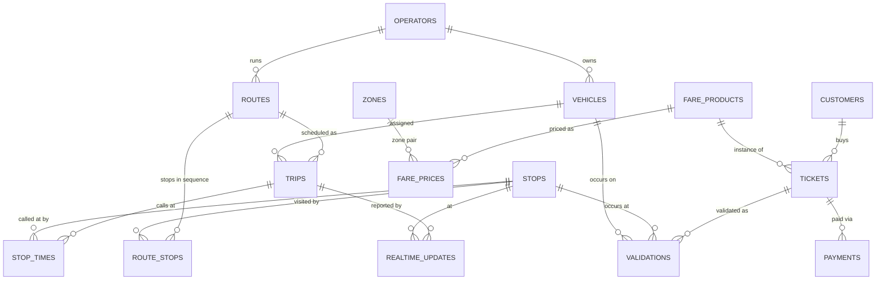

# Mobility Ticketing System — Design Notes (Week 1)

## Scope of this iteration

The brief so far covers: buses/trams/trains in a city; customers searching
routes, viewing departures/delays, buying digital tickets, and validating
tickets on boarding; operators maintaining routes/timetables, products and
prices, and viewing usage/revenue reports. The system needs to survive
rush-hour load, ingest frequent real-time updates, be correctness-critical
for purchases/validations, and retain data long-term for reporting and
compliance.

Since the brief will grow week to week, this schema is deliberately laid
out in clear subsystems (network/timetable, real-time, fares/ticketing,
validation, reporting) so future weeks can extend one area without
reshaping the others.

## Entity-relationship overview

## Subsystems and key tables

### 1. Network & timetable (static schedule)
- `operators` — the transit companies (bus/tram/train operators).
- `stops` — physical stops/stations, with geo-coordinates and a `mode`.
- `zones` — fare zones a stop belongs to (many-to-many via `stop_zones`),
  used for zone-based pricing.
- `routes` — a line (e.g. "Tram 7"), belongs to one operator and mode.
- `route_stops` — the ordered stopping pattern of a route (sequence
  number + typical offset from route start). This is the *pattern*, not a
  specific day's run.
- `trips` — one scheduled run of a route on a specific service date
  (e.g. "Tram 7, 08:14 departure, 2026-09-07"). This is what a timetable
  update actually edits.
- `stop_times` — the scheduled arrival/departure at each stop for a given
  trip. Route search and departure boards read this table.
- `vehicles` — physical buses/trams/trains, optionally assigned to a trip.

Rationale: separating `route_stops` (pattern) from `trips`/`stop_times`
(specific scheduled instances) lets operators publish a new timetable
(new trips) without redefining the route geometry, and lets each service
date have its own trips (so a one-off Sunday change doesn't touch the
weekday schedule).

### 2. Real-time layer
- `realtime_updates` — append-only feed of observed/estimated delay and
  occupancy at a given trip+stop, timestamped. Departure boards and route
  search join the *latest* row per (trip, stop) onto the static schedule
  rather than mutating `stop_times` in place — this keeps the static
  timetable auditable and lets us replay how a delay evolved.

This is intentionally an append-only log rather than a mutable "current
delay" column: rush-hour ingestion is write-heavy and we don't want
read/write contention on the row every consumer is also reading, and we
keep history for later "how reliable is this route" reporting.

### 3. Fares & products
- `fare_products` — the sellable product (Single Ride, Day Pass, Weekly
  Pass, Zone 1-2 Monthly, ...), with a validity duration and rules.
- `fare_prices` — versioned price for a product (optionally per zone
  pair), with `valid_from`/`valid_to`. Prices are never edited in place —
  a price change inserts a new row and closes the old one — so a ticket
  always points at the exact price that was in effect at purchase time,
  which is what compliance/reporting needs.

### 4. Ticketing (correctness-critical)
- `customers` — account holders.
- `tickets` — a purchased, digital ticket: references the product, the
  exact `fare_price` applied, a `status` (`active`, `used`, `expired`,
  `refunded`), a `valid_from`/`valid_until` window, and an opaque
  `validation_code` (what the QR code encodes).
- `payments` — one row per payment attempt against a ticket purchase,
  with `status` (`pending`, `succeeded`, `failed`, `refunded`). A ticket
  is only `active` once its payment `succeeded` — modeled with a DB
  transaction in the purchase endpoint, not a trigger, to keep the
  business rule visible in application code.

### 5. Validation (correctness-critical)
- `validations` — an immutable event log: "this ticket was validated on
  this vehicle/at this stop at this time, with this result". Validating
  a ticket does not delete or overwrite anything; a single-ride ticket's
  `status` flips to `used` as a side effect inside the same transaction,
  but the event row is permanent, which is what "long-term storage for
  compliance" requires (e.g. proving a rider tapped in during an
  inspection dispute).

### 6. Reporting
Reporting is deliberately built as SQL views over the append-only tables
above rather than new mutable tables:
- `v_daily_revenue` — revenue by day / route / product, from `payments`
  joined to `tickets`.
- `v_route_usage` — validation counts by day / route / stop, from
  `validations` joined to `tickets` and `trips`.
- `v_route_punctuality` — average delay by route/day from
  `realtime_updates`.

Building these as views (not batch-computed tables) is right for this
data volume and keeps reports always current; if reporting later needs
to run over years of history without touching the operational tables, a
future iteration can add a nightly rollup table without changing this
week's schema.

## Indexing for the stated workloads

- **Route search** (find trips between two stops around a time): index
  on `stop_times(stop_id, scheduled_departure)` and
  `route_stops(route_id, sequence)`.
- **Ticket validation** (look up a ticket fast by its scan code): unique
  index on `tickets(validation_code)`.
- **Real-time availability** (latest delay for a trip/stop): index on
  `realtime_updates(trip_id, stop_id, recorded_at DESC)`.
- **Reporting**: indexes on `payments(created_at)`, `validations(validated_at)`
  to keep date-ranged aggregates off full scans.

## What's out of scope for this iteration

- AuthN/authZ, multi-city/multi-tenant partitioning, seat-level
  reservations, refund workflows beyond a status flag, GTFS-realtime
  protocol compatibility. These are candidates for later weeks as the
  brief expands.

## Stack

- **Database**: SQLite (file-based, via `better-sqlite3`) — easy to run
  end-to-end in this environment; the schema uses only portable SQL so a
  later move to Postgres is a driver swap, not a redesign.
- **API**: Node.js + Express, one router per subsystem.
- **UI**: React (Vite), a customer-facing app (search, buy, validate) and
  an operator console (timetables, products, reports).
